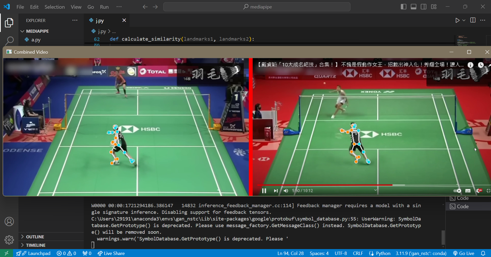

# skeleton_detection_similarity

This is a series of skeletal similarity detections between two videos.

The only code that can execute the **skeleton_detection_similarity** is **j.py**.

# Package
```
pip install mediapipe numpy opencv-python
```

# Code Explain
<table>
  <tr>
    <th>Program</td>
    <th>Explain</td>
  </tr>
  <tr>
    <td>a.py</td>
    <td>Test whether the mediapipe can execute normally</td>
  </tr>
  <tr>
    <td>b.py</td>
    <td>How to extract the skeleton for angle calculations <br> Determine current posture by calculating angles</td>
  </tr>
  <tr>
    <td>c.py</td>
    <td>Use OpenCV to read video</td>
  </tr>
  <tr>
    <td>d.py</td>
    <td>Use OpenCV to read two video</td>
  </tr>
  <tr>
    <td>e.py</td>
    <td>Use OpenCV to read two video <br> One on the left and one on the right</td>
  </tr>
  <tr>
    <td>f.py</td>
    <td>Use OpenCV to read video <br> Do skeleton detect</td>
  </tr>
  <tr>
    <td>g.py</td>
    <td>Use OpenCV to read two video <br> One on the left and one on the right <br> Do skeleton detect <br> Currently unavailable <br> Because mediapipe does not support detecting the skeletons of multiple people</td>
  </tr>
  <tr>
    <td>h.py</td>
    <td>Use OpenCV to read two video <br> Do skeleton detect separately <br> There is two videos so we have two windows</td>
  </tr>
  <tr>
    <td>i.py</td>
    <td>Use OpenCV to read two video <br> Do skeleton detect separately <br> After analysis, merge into the same window for viewing</td>
  </tr>
  <tr>
    <td>j.py</td>
    <td>Use OpenCV to read two video <br> Do skeleton detect separately <br> And analyze the skeleton similarity <br> After analysis, merge into the same window for viewing</td>
  </tr>
</table>

# Demo
Take **j.py** as an example :
<video width="400" height="210" controls><source src="demo.mp4" type="video/mp4"></video>
</img>

# References
[使用Mediapipe分析動作](https://hackmd.io/@am534143/r1pch8Y1p#%E4%BD%BF%E7%94%A8Mediapipe%E5%88%86%E6%9E%90%E5%8B%95%E4%BD%9C) reference of a.py & b.py \
[Mediapipe姿勢偵測Pose](https://steam.oxxostudio.tw/category/python/ai/ai-mediapipe-pose.html)\
[B3.mp4 & B4.mp4](https://www.youtube.com/watch?v=fnoN_HjGm7g&t=370s) from YT 5:44\
[B5.mp4 & B6.mp4](https://www.youtube.com/watch?v=_zkmY1H0uRo) from YT 2:40\
[B7.mp4 & B8.mp4](https://www.youtube.com/watch?v=LmrKejHOaG4&t=347s) from YT 5:40
